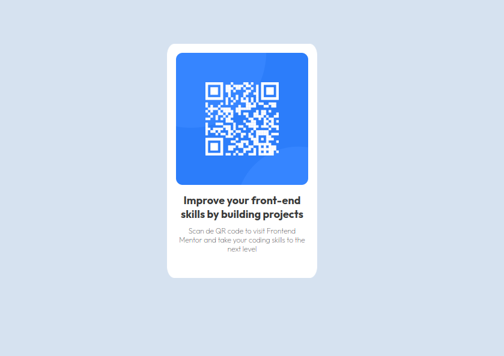

## Table of contents

- [Overview](#overview)
  - [Screenshot](#screenshot)
  - [Links](#links)
- [My process](#my-process)
  - [Built with](#built-with)
  - [What I learned](#what-i-learned)

## Overview

### Screenshot

### Links

- Solution URL: [https://github.com/jesuswrivas/qrchallenge.git]

## My process

### Built with

- HTML5 markup
- CSS custom properties

### What I learned

This first challenge made me realize I have major issues placing the content exactly where I want it:

-Vertical centering
-Spacing between divs

As well as lack of understanding of good practices.

